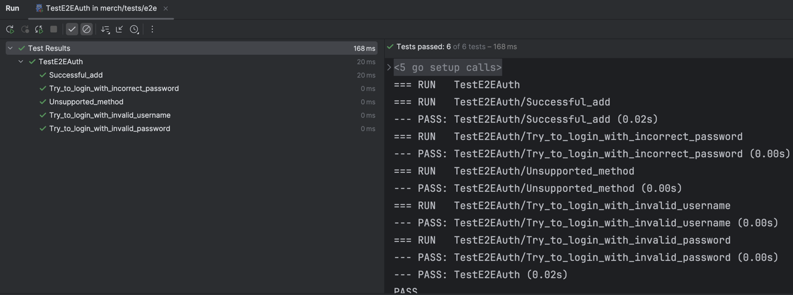
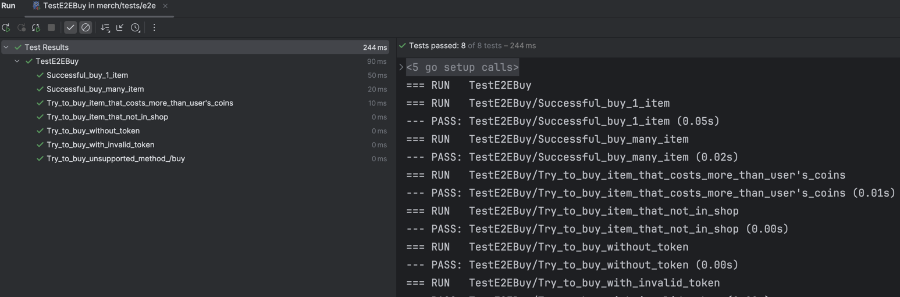
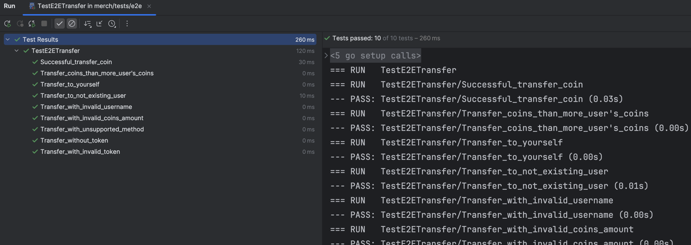
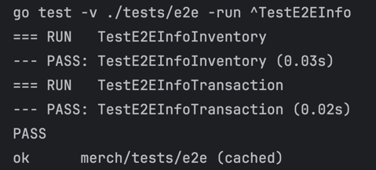
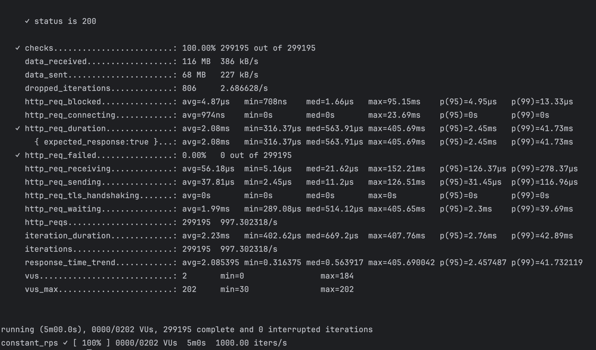

# Тестовое задание "Приложение API Avito shop"

## Содержание
- [Задание](#задание)
- [Использование](#использование)
- [Реализация](#реализация)
    - [Тесты](#тесты)
    - [Структура проекта](#структура-проекта)
    - [Результаты тестов](#результаты-тестов)

___
### Задание
Необходимо по документации написать сервис, сотрудников до 100к, RPS - 1k, SLI времени ответа - 50 мс,
SLI успешности ответа - 99.99%. Для авторизации использовать токен JWT.

Покрыть код unit и E2E/интеграционными тестами.
___
## Использование
1. Склонировать репозиторий: ```git clone https://github.com/Saljaev/merch```, прописать ```cd merch```.
2. Прописать ```make prepare```, который сгенерирует .env для работы приложения.
3. Прописать ```make build```, а затем ```make start``` (docker compose up).
4. После работы прописать ```make delete```  (docker compose down -v).
5. Прикрепляю готовую коллекцию Postman для запросов, для его испольования нужно сделать следующее: ```Postman -> File -> Import``` и выбрать [avito-merch](/pkg/avito-merch.postman_collection.json).
   *(В коллекции написан скрипт автоматизирующий подстановку полученного токена в header)*

___
## Реализация:
В своем сервисе использовал следующее:
- Шардирование - так как пользователей много и с заделкой на будущее используется шардирование, что
также снимает нагрузку с БД. Используется **pgxpool** для соединений и переменная **shard_number** в файле [config.yaml](config/config.yaml).
для динамической настройки количества шардов. В качестве алгоритма выбора шарда использовал ```user_id % shard_number```.
- Кэш - написан собственный с использованием **дженериков** и **ttl**, в основе лежит *map* и *mutex* для предотвращения 
_race condition_. При каждом получении значения с кэша продлевается его время жизни.
- Собственная обертка на **context** и **роутер**, благодаря чему handler становится более изолированным и, следовательно, безопасным.
Роутер создает новую **горутину** на каждое подключение. Для каждого запроса используется *context.Timeout*,
который ограничивает время обработки запроса, а также на сервисе установлено ограничение на чтение и запись запросов.
- Магазин мерча - реализовал на основе *map*, данные в магазин поступают из файла [store.txt](internal/usecase/repo/shop/store.txt)
с помощью **go:embed**. Благодаря этому можно удобно изменять предметы в магазине, а *map* ускоряет процесс покупки предмета.
- Миграции к БД применяются с помощью *docker migrate*.

Для разработки использовалась ветка _git dev_, основной веткой является **prod**. Старался минимизировать использование готовых библиотек и фреймворков, из крупного только [jwt](https://github.com/golang-jwt/jwt)
, для генерации **user_id** [sonyflake](https://github.com/sony/sonyflake) и [pgxpool](https://github.com/jackc/pgx)
для конкурентного обращения к БД.

Весь код был отформатирован в соотвествии с линтером. Для запуска линтера ```make lint```.
Написан [.golangci.yaml](.golangci.yaml) с использованием [golangci-lint](https://golangci-lint.run/usage/linters/), который включает в себя:
- проверки на не обработанных ошибок, проверки приведения типов
- проверка на оптимизацию кода, упрощение и более читаемые конструкции
- проверка кода на потенциальные ошибки
- проверка на мертвый код и не используемые переменные
- проверка на уязвимости в безопасности


### Тесты:
- Покрыл основную бизнес логику unit тестами с использованием [mock](https://pkg.go.dev/github.com/stretchr/testify/mock),
моки для интерфейсов генерировал с помощью [mockery](https://github.com/vektra/mockery).
- Написал следующие E2E тесты, для этого создал отдельное пространство в [tests](tests), самостоятельный dockerfile
и docker-compose.yaml. При желании провести тесты можно воспользоваться командами **make**: ```e2e-prepare, e2e-build, 
e2e-auth, e2e-buy, e2e-send, e2e-delete, e2e-info```. Команда для создания .env, сборки образов, запуска и проведения 
теста, соответственно.
  - Для [/api/auth](tests/e2e/e2e_auth_test.go)
  - Для [/api/buy](tests/e2e/e2e_buy_test.go)
  - Для [/api/sendCoin](tests/e2e/e2e_transfer_test.go)
  - Для [/api/info](tests/e2e/e2e_info_test.go)
- Написал нагрузочное тестирование, за основу выбрал [k6](https://k6.io/), тестирование проводится внутри контейнера. 
Для запуска прописать ```make load-test-build и make load-test-start (с автоматическим удалением после теста)```.

  
___
### Структура проекта
```

merch
├── cmd
│   └── backend
│       └── main.go <- Точка входа в приложение
├── config
│   └── config.yaml <- Файл конфигурации
├── internal
│   ├── api
│   │   ├── handlers
│   │   │   ├── auth
│   │   │   │   └── jwtManager.go <- Работа с токеном
│   │   │   └── merch
│   │   │       ├── merchHandler <- Хэндлер
│   │   │       └── ... <- Эндпоинты и функции их обработки
│   │   └── utilapi
│   │       ├── context <- Обертка на контекст
│   │       └── router <- Обертка на роутер
│   ├── app
│   │   └── app.go <- Файл сборки всех зависимостей
│   ├── cache
│   │   └── ... 
│   ├── config
│   │   └── config.go <- Загрузка и настройка конфигурации
│   ├── entity
│   │   └── user <- Сущности
│   ├── migrations
│   │   └── ... <- Файлы миграции
│   └── usecase
│       ├── mocks
│       │   └── ... <- Моки для тестирования
│       ├── repo
│       │   ├── postgres
│       │   │   └── db.go <- Работа с базой данных и шардами
│       │   └── shop
│       │       ├── shop.go <- Магазин мерча
│       │       └── store.txt <- Ассортимент магазина
│       ├── interfaces <- Интерфейсы взаимодействия
│       └── storage <- Основная бизнес логика
├── pkg
│   └── k6
│       ├── Dockefile <- Контейнер, проводящий нагрузочное тестирование
│       └── script.js <- Скрипт нагрузочного тестирования
├── tests
│   └── E2E
│       └── ... <- E2E тесты и окружение
├── env <- Переменные окружения для настройки и деплоя
├── docker-compose.yaml <- Конфигурация всех контейнеров 
└── Dockefile <- Сборка сервиса
```
___

## Результаты тестов
**E2E /api/auth**
<br><br><br>
**E2E /api/buy**
<br><br><br>
**E2E /api/sendCoin**
<br><br><br>
**E2E /api/info**
<br><br><br>
**Нагрузочное тестирование**
<br><br>


   
